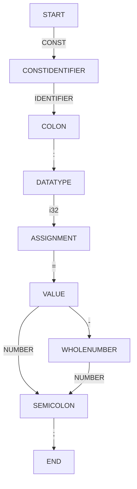

# Лабораторная работа: Разработка сканера для объявлений целочисленных констант в Rust

## Постановка задачи
Цель работы - создать лексер, способный распознавать корректные объявления целочисленных констант языка Rust с возможностью обработки синтаксических ошибок и автоисправлений. Лексер должен:
1. Выделять токены согласно заданной грамматике
2. Обнаруживать и классифицировать ошибки
3. Предлагать варианты коррекции с ограничением до 15 исправлений

## Персональный вариант задания
Анализировать объявления констант формата:
```rust
const <IDENTIFIER>: i32 = <NUMBER>;
```
Требования:
- Идентификатор: начинается с буквы/подчёркивания, содержит буквы, цифры и _
- Тип данных: `i32`
- Обязательная инициализация
- Поддержка отрицательных чисел
- Завершающая точка с запятой

## Примеры допустимых строк
1. `const MAX_SIZE: i32 = 100;`
2. `const _COUNT: i32 = -42;`
3. `const TEMP: i32 = 0;`

## Диаграмма состояний сканера


## Тестовые примеры

### Пример 1: Корректный ввод
**Вход:**  
`const X: i32 = 42;`

**Вывод токенов:**
```
CONST   const   (1:1)
IDENTIFIER X    (1:7)
COLON   :       (1:8)
I32     i32     (1:10)
ASSIGN  =       (1:13)
NUMBER  42      (1:15)
SEMICOLON ;     (1:17)
```

### Пример 2: Опечатка в ключевом слове
**Вход:**  
`conts Y: i32 = 10;`

**Ошибки:**  
`(1:1) Замена 'conts' на 'const'`

### Пример 3: Пропущен знак равенства
**Вход:**  
`const Z: i32 5;`

**Исправления:**  
`(1:12) Вставка отсутствующего токена: '='`

### Пример 4: Некорректный идентификатор
**Вход:**  
`const 123var: i32 = 7;`

**Ошибки:**  
`(1:7) Удаление недопустимого токена: '123var'`  
`(1:7) Вставка исправленного идентификатора`

### Пример 5: Превышение лимита исправлений
**Вход:**  
`const A: int == 3;;`

**Ошибка:**  
`(0:0) Превышен лимит исправлений (15)`
