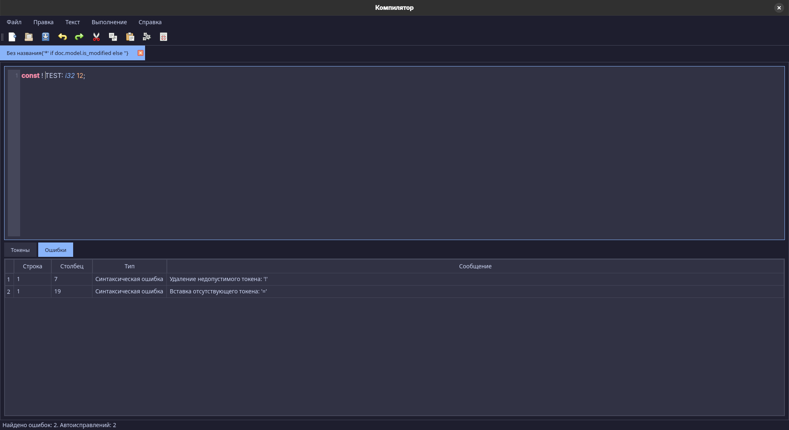

# Лабораторная работа 1

## Пункты меню

- Файл → Создать (Ctrl+N) -  Создает новую вкладку с пустым текстовым файлом. Имя файла по умолчанию — "NewFileN.txt", где N — номер следующего файла.
- Файл → Открыть (Ctrl+O) - Открывает диалог для выбора текстового файла, который затем отображается в новой вкладке с именем файла.
- Файл → Сохранить (Ctrl+S) - Сохраняет содержимое текущей вкладки. Если файл уже имеет путь, сохраняет по нему; иначе открывает диалог "Сохранить как".
- Файл → Сохранить как - Открывает диалог для сохранения текущей вкладки под новым именем и в новом месте.
- Файл → Выход - Закрывает приложение с запросом сохранения всех измененных вкладок.
- Правка → Отменить - Отменяет последнее действие в текущей вкладке (например, удаление текста).
- Правка → Повторить - Повторяет отмененное действие в текущей вкладке.
- Правка → Вырезать - Вырезает выделенный текст из текущей вкладки в буфер обмена.
- Правка → Копировать - Копирует выделенный текст в буфер обмена.
- Правка → Вставить - Вставляет текст из буфера обмена в текущую вкладку.
- Правка → Удалить - Удаляет выделенный текст в текущей вкладке.
- Правка → Выделить все - Выделяет весь текст в текущей вкладке.
- Пуск - Запуск парсера, пока не реализован.
- Справка → Справка - Открывает этот документ с описанием функций приложения.
- Справка → О программе - Показывает окно с информацией о программе (версия, автор).

## Область ввода текста
Область ввода текста расположена в центральной части окна и представлена вкладками. Каждая вкладка соответствует открытому файлу и содержит:

- Номера строк - Слева от текста отображаются номера строк, которые автоматически обновляются при добавлении или удалении строк. Прокрутка номеров синхронизирована с текстом.
- Текстовый редактор - Основная область для ввода и редактирования текста. Поддерживает многострочный ввод, табуляцию и прокрутку при превышении видимой области.
- Закрытие вкладки - Крестик "×" на заголовке вкладки позволяет закрыть её с запросом сохранения изменений, если они есть.


# Лабораторная работа 2: Разработка сканера для объявлений целочисленных констант в Rust

## Постановка задачи
Цель работы - создать лексер, способный распознавать корректные объявления целочисленных констант языка Rust с возможностью обработки синтаксических ошибок и автоисправлений. Лексер должен:
1. Выделять токены согласно заданной грамматике
2. Обнаруживать и классифицировать ошибки
3. Предлагать варианты коррекции с ограничением до 15 исправлений


## Персональный вариант задания
Анализировать объявления констант формата:
```rust
const <IDENTIFIER>: i32 = <NUMBER>;
```
Требования:
- Идентификатор: начинается с буквы/подчёркивания, содержит буквы, цифры и _
- Тип данных: `i32`
- Обязательная инициализация
- Поддержка отрицательных чисел
- Завершающая точка с запятой

## Примеры допустимых строк
1. `const MAX_SIZE: i32 = 100;`
2. `const _COUNT: i32 = -42;`
3. `const TEMP: i32 = 0;`

## Диаграмма состояний сканера


## Тестовые примеры

### Пример 1: Корректный ввод
**Вход:**  
`const X: i32 = 42;`

**Вывод токенов:**
```
CONST   const   (1:1)
IDENTIFIER X    (1:7)
COLON   :       (1:8)
I32     i32     (1:10)
ASSIGN  =       (1:13)
NUMBER  42      (1:15)
SEMICOLON ;     (1:17)
```

### Пример 2: Опечатка в ключевом слове
**Вход:**  
`conts Y: i32 = 10;`

**Ошибки:**  
`(1:1) Замена 'conts' на 'const'`

### Пример 3: Пропущен знак равенства
**Вход:**  
`const Z: i32 5;`

**Исправления:**  
`(1:12) Вставка отсутствующего токена: '='`

### Пример 4: Некорректный идентификатор
**Вход:**  
`const 123var: i32 = 7;`

**Ошибки:**  
`(1:7) Удаление недопустимого токена: '123var'`  
`(1:7) Вставка исправленного идентификатора`

### Пример 5: Превышение лимита исправлений
**Вход:**  
`const A: int == 3;;`

**Ошибка:**  
`(0:0) Превышен лимит исправлений (15)`


# Лабораторная работа 3 - 4: Разработка грамматики для объявлений целочисленных констант в Rust




## Разработанная грамматика
```
G[Z]
P:
  <START>                 -> 'const' <SPACE_AFTER_CONST>
  <SPACE_AFTER_CONST>     -> ' ' <CONST_IDENTIFIER>
  <CONST_IDENTIFIER>      -> initial_character <CONST_IDENTIFIER_REM>
  <CONST_IDENTIFIER_REM>  -> character <CONST_IDENTIFIER_REM>
  <CONST_IDENTIFIER_REM>  -> ':' <DATA_TYPE>
  <DATA_TYPE>             -> 'i32' <ASSIGNMENT>
  <ASSIGNMENT>            -> '=' <VALUE>
  <VALUE>                 -> '-' <WHOLE_NUMBER>
  <VALUE>                 -> digit <NUMERICAL_REM>
  <WHOLE_NUMBER>          -> digit <NUMERICAL_REM>
  <NUMERICAL_REM>         -> digit <NUMERICAL_REM>
  <NUMERICAL_REM>         -> ';' <END>

digit                        -> 0 | 1 | 2 | 3 | 4 | 5 | 6 | 7 | 8 | 9
initial_character            -> a | b | ... | z | A | B | ... | Z
character                    -> a | b | ... | z | A | B | ... | Z | 0 | 1 | ... | 9

V_n = {
  <START>,
  <SPACE_AFTER_CONST>,
  <CONST_IDENTIFIER>,
  <CONST_IDENTIFIER_REM>,
  <DATA_TYPE>,
  <ASSIGNMENT>,
  <VALUE>,
  <WHOLE_NUMBER>,
  <NUMERICAL_REM>,
  <END>
}

V_t = {
  'const',
  ' ',
  ':',
  'i32',
  '=',
  '+',
  '-',
  ';',
  digit,
  initial_character,
  character
}
```
